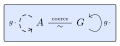

<p align="center">
  
</p>


# Acts <a href="https://hackage.haskell.org/package/acts" alt="Hackage"></a>

* [Introduction](#intro)
* [Examples](#examples)
  - [Points and vectors](#affinespace)
  - [Time](#time)
  - [Musical intervals](#intervals)
* [Comparison with existing libraries](#comparison)

<a name="intro"></a>
# Introduction

**acts** is a Haskell library for semigroup actions and torsors.

An *act* denotes the ability to apply transformations in a compositional way:

```haskell
act g ( act h x ) = act ( g <> h ) x
```

That is, the target of an act is not necessarily a semigroup, but can be transformed by a semigroup.

Note that this is a *left* act (elements of the semigroup act on the left).
This library does not define right acts, but they can be emulated as left acts of the opposite semigroup by using the `Dual` newtype.


When there's a unique transformation taking one element to another element, the act is said to be a *torsor*:

```haskell
act ( x --> y ) x = y
```


<a name="examples"></a>
# Examples

<a name="affinespace"></a>
## Points and vectors

Addition of points in the plane is not meaningful, but points can be translated by spatial vectors, and given any two points there is a unique translation taking the first point to the second point.

```haskell
data Point2D a = Point2D !a !a
  deriving stock ( Show, Generic )
  deriving ( Act ( Vector2D a ), Torsor ( Vector2D a ) )
    via Vector2D a
newtype Vector2D a = Vector2D { tip :: Point2D a }
  deriving stock Show
  deriving ( Semigroup, Monoid, Group )
    via GenericProduct ( Point2D ( Sum a ) )
```

Here we use `DerivingVia` and generics (with [generic-data](https://hackage.haskell.org/package/generic-data) and [groups-generic](https://hackage.haskell.org/package/groups-generic)) to obtain the relevant instances.

```haskell
p1, p2, p3 :: Point2D Double
p1 = Point2D 0.5 2.5
p2 = Point2D 1.0 0.0
p3 = Point2D 1.0 4.0

v1, v2 :: Vector2D Double
v1 = Vector2D ( Point2D 0.0 1.0 )
v2 = Vector2D ( Point2D 1.0 1.0 )
```

We can't add points:

```haskell
> p1 <> p2
```
```
* No instance for (Semigroup (Point2D Double))
    arising from a use of `<>`
```

but we can add vectors:

```haskell
> v1 <> v2
Vector2D {tip = Point2D 1.0 2.0}
```

as well as reverse them:

```haskell
> invert v1
Vector2D {tip = Point2D 0.0 (-1.0)}
```

Two points form a vector:

```haskell
v12, v13, v23 :: Vector2D Double
v12 = p1 --> p2
v13 = p1 --> p3
v23 = p2 --> p3
```

```haskell
> v12
Vector2D {tip = Point2D 0.5 (-2.5)}
```

We can translate points by vectors:

```haskell
> act v12 p1
Point2D 1.0 0.0
```

```haskell
> act ( invert v12 ) p2
Point2D 0.5 2.5
```

Translations compose:

```haskell
> v13
Vector2D {tip = Point2D 0.5 1.5}
```

```haskell
> v23 <> v12
Vector2D {tip = Point2D 0.5 1.5}
```

As we are acting on the left, transformations compose from right to left, just like function composition:

```haskell
act ( b --> c ) . act ( a --> b ) = act ( a --> c )
```

This looks slightly more intuitive using `(<--)`:

```haskell
act ( c <-- b ) . act ( b <-- a ) = act ( c <-- a )
```

Note that in the case of translation these distinctions are irrelevant, as translations form a *commutative* group.

<a name="time"></a>
## Time

We can similarly distinguish absolute time (such as time obtained by querying the operating system) and time differences.

```haskell
newtype Seconds   = Seconds { getSeconds :: Double }
  deriving stock Show
  deriving ( Act TimeDelta, Torsor TimeDelta )
    via TimeDelta
newtype TimeDelta = TimeDelta { timeDeltaInSeconds :: Seconds }
  deriving stock Show
  deriving ( Semigroup, Monoid, Group )
    via Sum Double
```

The distinction is useful to prevent mixing up absolute times with time differences, so that one doesn't accidentally add two absolute times together:

```haskell
> Seconds 3 <> Seconds 4
```
```
* No instance for (Semigroup Seconds) arising from a use of `<>`
```

This might seem trivial in isolation, but in the middle of a complex application it can be very helpful to have the compiler enforce this distinction,
so that one doesn't have to e.g. remember whether the time value one has elsewhere stored in an `IORef` is absolute or relative.

Having to manually unwrap the `TimeDelta` newtype at use-sites would prove to be quite inconvenient;
instead the interface this library provides comes in handy:

```haskell
> act ( TimeDelta ( Seconds 3 ) ) ( Seconds 4 )
Seconds {getSeconds = 7.0}
```

```haskell
> Seconds 3 --> Seconds 4 :: TimeDelta
TimeDelta {timeDeltaInSeconds = Seconds {getSeconds = 1.0}}
```

This can be used for instance to tick down a timer after some time has elapsed:

```haskell
countdownTimer :: Seconds -> Seconds -> TimeDelta -> TimeDelta
countdownTimer startTime endTime timeRemaining =
  act ( endTime --> startTime ) timeRemaining
```

<a name="intervals"></a>
## Musical intervals

[Acts.Examples.MusicalIntervals](https://hackage.haskell.org/package/acts/docs/Acts-Examples-MusicalIntervals.html) demonstrates the application of this library to musical intervals.

In summary:

  * Musical note names are a torsor under the cyclic group of order 7

  ```haskell
  -- Cyclic group of order 7.
  type C7 = Sum ( Finite 7 ) -- 'Finite' from the 'finite-typelits' package

  data NoteName = C | D | E | F | G | A | B
    deriving stock    ( Eq, Show, Generic )
    deriving anyclass Finitary
    deriving ( Act C7, Torsor C7 )
      via Finitely NoteName
  ```

  In this case we use the [finitary](https://hackage.haskell.org/package/finitary) package to derive the action,
  using the newtype `Finitely`.

  * Musical notes are a torsor under musical intervals, meaning that:

    - we can transpose notes by musical intervals

    ```haskell
    diminished7th :: [ Interval ]
    diminished7th = [ Interval 1 Natural, Interval 3 Flat, Interval 5 Flat, Interval 7 DoubleFlat ]
    
    > map ( `act` Note G Sharp 3 ) diminished7th
    [ "G#3", "B3", "D4", "F4" ]
    ```

    - we can compute intervals between notes

    ```haskell
    > Note F Natural 3 --> Note B Natural 3 :: Interval
    Interval 4 Sharp
    "augmented 4th up"
    
    > Note E Flat 4 --> Note C Flat 6 :: Interval
    Interval 13 Flat
    "minor 13th up"
    ```

<a name="comparison"></a>
# Comparison with existing libraries

The main purpose of this library is to provide convenient functionality for *torsors*. Other packages such as
[torsor](https://hackage.haskell.org/package/torsor), [vector-space](https://hackage.haskell.org/package/vector-space), [simple-affine-space](https://hackage.haskell.org/package/simple-affine-space) and [Linear.Affine](https://hackage.haskell.org/package/linear/docs/Linear-Affine.html) concentrate on affine spaces (as reflected in their syntax), and as a result don't naturally cover the use case of finite actions (such as the action of a cyclic group on musical notes given above).    

The other design choice of this library is to focus on using newtypes and let users choose instances with `DerivingVia`,
trying to re-use newtypes from the `base` library when possible.     
This works around some difficulties with overlapping instances (although it is hardly a robust or comprehensive solution).    
To compare with other libraries that define semigroup actions (but not torsors):

  * [semigroup-actions](https://hackage.haskell.org/package/semigroups-actions) uses a similar approach,
  but the use of a newtype for the action of a semigroup on itself precludes many useful usages of `DerivingVia`
  (such as the [affine space](#affinespace) and [time](#time) examples given above).
  * [monoid-extras](https://hackage.haskell.org/package/monoid-extras) also defines newtypes for instances,
  but these aren't easily usable with `DerivingVia` as they focus on the first (instead of last) type parameter.

This library is also careful to distinguish left and right actions, with the `Dual` newtype:

```haskell
instance ( Semigroup s, Act s a, Act t b ) => Act ( Dual s, t ) ( a -> b ) where
  act ( Dual s, t ) p = act t . p . act s
```

This captures the fact that, if `a` has a left action by `s`, and `b` a left action by `t`,
then `a -> b` has a *right* action by `s` and a left action by `t`.


<br>
